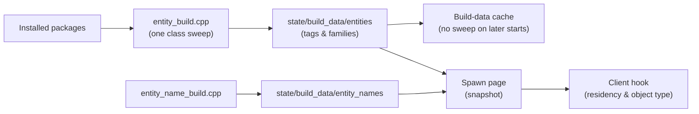

# Local gameplay and mission scope

## Current scope

Sunrise supports offline destination loading and exploration. It does not currently support mission gameplay. The repository README lists missions, enemies, NPCs, quests, and persistent saves as unsupported features. See the [project README](../README.md).

The local gameplay code provides a foundation for server-owned activity state. It does not yet implement Destiny mission scripts or complete NPC behavior.

## Existing gameplay foundation

The local server includes these gameplay subsystems:

- BAP, HTTP, and gameplay transport.
- Activity sessions, membership, and entity-slot management.
- Peer, group, association, and DTLS handling.
- Fixed-step logical worlds and replication.
- Actor creation, removal, authority, motion, and teleports.
- Generic navigation, combat, damage, triggers, objectives, credits, incidents, and timers.
- World checkpoints and command journals.

The gameplay runtime starts the endpoint and the physics host. See [`gameplay_runtime.cpp`](../Sunrise/src/server/gameplay/gameplay_runtime.cpp).

The host command model includes `SpawnActorCommand`, combat configuration, trigger, objective, and timer commands. See [`host_command.h`](../Sunrise/src/server/gameplay/physics/world/host_command.h).

These commands are generic server primitives. They do not describe an enemy type, an encounter wave, a campaign objective, or a Destiny mission state machine.

## Default world behavior

A new gameplay world uses the scriptless fallback policy. That policy creates no actors, submits no commands, and makes no mission decisions. See [`fallback_policy.cpp`](../Sunrise/src/server/gameplay/physics/host/fallback_policy.cpp).

The activity-session bridge opens its world with a null policy. The fallback spawns nothing and makes no mission choice. The world bounds remain a zero box. See [`physics_session.cpp`](../Sunrise/src/server/gameplay/physics/host/physics_session.cpp).

The presence of actor and combat commands does not mean that the project runs campaign encounters.

## Player spawn sets

Sunrise extracts authored spawn-set data from installed packages. The client uses this data to select a destination, a bubble, and a player spawn-set hash.

The spawn-set builder scans installed packages and publishes stems, hashes, and points. See [`spawn_set_build.cpp`](../Sunrise/src/client/content/spawn_sets/spawn_set_build.cpp).

This supports player placement in loaded destinations. It is separate from enemy or encounter spawning.

## Manual entity spawner

The manual spawner does not use the local server actor path.

The UI calls `client::hooks::spawn::request` or `request_line`. The client stores the request and
processes it from the hooked player-component update. The client then performs these steps:

1. Resolve the entity tag in the loaded game content.
2. Build a native placement record.
3. Call the game's placement initializer.
4. Call the game's object factory.
5. Apply a transform when the object needs activation.
6. Keep the local object handle for tracking.

The client also uses the game's world raycast to find crosshair positions and ground positions.
The code does not send a BAP request or a gameplay UDP spawn message for this operation.

This has several consequences:

- The spawned object is local to the current game process.
- The spawner does not notify other clients.
- The server does not own the object's logical identity.
- The client-side population tracker is not server authority.
- The population module does not currently remove a placed object through a known game call.

The implementation is in [`spawn_runtime.cpp`](../Sunrise/src/client/hooks/spawn/spawn_runtime.cpp).
Every game call it uses is found by a byte signature at install time. See
[Reverse engineering notes](reverse-engineering-notes.md).

### Where the spawnable list comes from

The Spawn page shows one row per installed entity. The list is build data, not a page-local scan:

The page asks the client hook whether a tag is loaded and which object type it carries, because
both belong to the running game and neither can be cached.

## Server actor path

The server has a separate generic actor path. `SpawnActorCommand` creates a logical actor in the
server `ActorStore`. The world runner commits the command and emits an actor-spawn event. The
replication layer can then project the actor into a generic gameplay representation.

The current manual spawner does not submit this command. The generic actor path is a foundation for
future server-owned gameplay. It is not a complete Destiny entity replication implementation.

## Current gameplay behavior

The server implements generic host-side controller, navigation, combat, damage, trigger, objective,
credit, incident, and timer services. These services operate on server logical actors and fixed
physics worlds.

The controller service can configure an actor, request a navigation path, move the actor toward
path waypoints, turn the actor, detect arrival, and report blocked or stalled movement. It is a
generic movement service. It is not a recovered Destiny enemy behavior system.

The combat kernel can create generic combatants, assign health and shields, record poses, validate
damage, and process combat events. It does not define Destiny enemy types, attacks, encounters, or
mission behavior.

The default `ScriptlessPolicy` creates no actors and submits no gameplay commands. The repository
does not contain a complete Destiny enemy AI or a confirmed interface to the native AI state.

The client spawner creates a native game object from an entity tag and a transform. The repository
does not confirm that this operation creates a complete combatant, controller, or AI instance.

## Reimplementing a Red War mission

Loading a Red War destination and selecting a player spawn is a bounded extension of the existing activity and spawn-set work.

Recreating a playable campaign encounter is a major task. It requires all of these components:

1. A mission policy that selects and changes mission phases.
2. Data extraction or definitions for each encounter, wave, trigger, objective, and checkpoint.
3. Actor creation with the correct transform, faction, authority, and client-visible identity.
4. NPC movement, targeting, abilities, damage, deaths, despawns, and respawns.
5. Client-compatible replication and activity messages for every state transition.
6. Support for mission-specific features such as restricted zones, wipes, dialogue, cinematics, rewards, and scripted world changes.
7. Per-mission validation against the supported game build.

The generic host provides server-side mechanics. It cannot replace the mission logic or NPC runtime through configuration alone.

## Relative difficulty

| Goal                                                         | Expected scope                                                                                           |
| ------------------------------------------------------------ | -------------------------------------------------------------------------------------------------------- |
| Load a destination and place the player at an authored spawn | Moderate. Sunrise already has destination and spawn-set systems.                                         |
| Create a static test actor through the local host            | Significant but limited. The work requires a policy, actor data, and client-compatible replication.      |
| Show enemies with basic movement and damage                  | Large. The work requires actor presentation, combat behavior, lifecycle handling, and protocol research. |
| Recreate one playable Red War encounter                      | Major reverse-engineering and implementation work.                                                       |
| Recreate the full Red War campaign                           | A long-term project with extensive mission, NPC, and client-compatibility work.                          |

## Development direction

Add new gameplay behavior to the local server path when possible. Do not use a client patch as a substitute for server-owned mission state. This follows the project contribution guidance in the [README](../README.md) and the layer boundaries in [AGENTS.md](../AGENTS.md).
