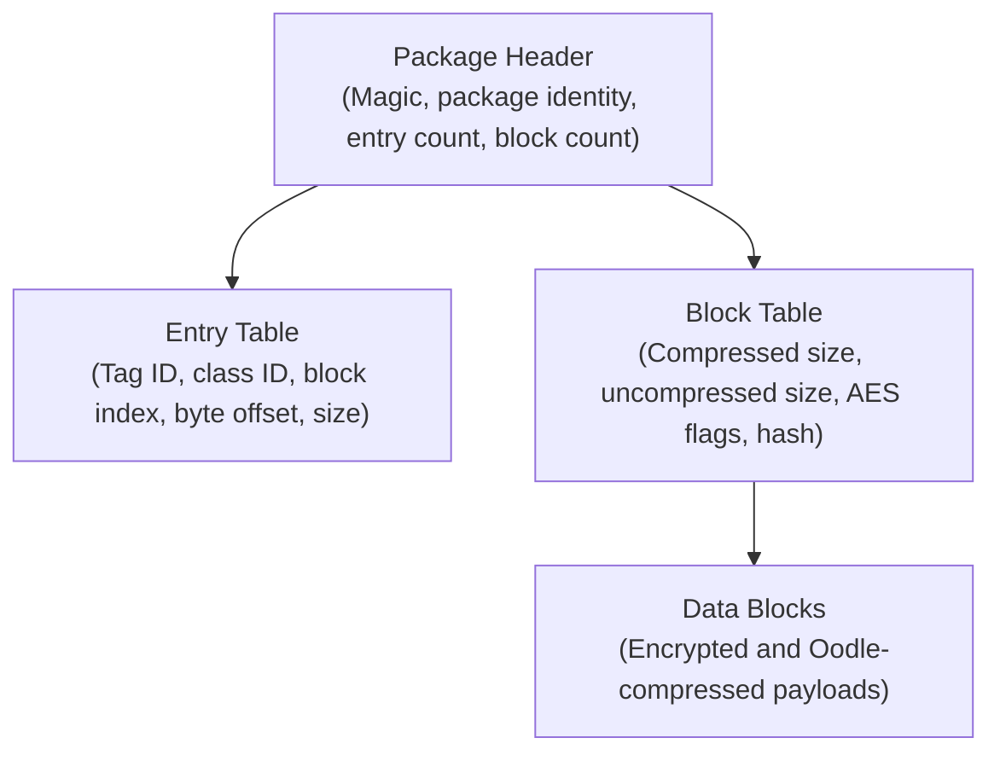
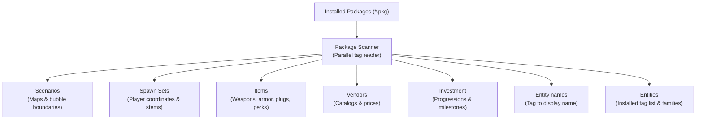

# Package and content system

This document describes the Destiny 2 package archive format (`.pkg`), tag resolution, decompression, and content extraction in Sunrise.

## Package format overview

Destiny 2 stores game assets in `.pkg` files inside the `packages/` directory. Packages contain structured binary data called **tags**. Tags represent items, activities, maps, audio, textures, and entities.

### 1. Package header

The package file begins with a binary header:

- **Magic identifier**: Validates file integrity.
- **Package identifier**: 16-bit integer identifying the package family.
- **Patch identifier**: Suffix index (such as `_0.pkg`, `_1.pkg`). Higher patch numbers override earlier versions.
- **Table offsets**: File offsets pointing to the entry table and block table.
- **Counts**: Number of entries and data blocks in the package.

### 2. Entry table

The entry table contains 16-byte records for each stored tag:

- **`reference`**: 32-bit class or reference identifier used by class scans.
- **`typeInfo`**: 32-bit packed type information.
- **`blockInfo`**: 64-bit packed placement containing the starting block, starting offset, and
  uncompressed length.

The reader derives a tag handle from the package ID and entry index. The entry index occupies the
low 13 bits.

### 3. Block table

Data is divided into discrete 256 KiB decompressed blocks (`kBlockSize = 0x40000`). Each
48-byte block record stores:

- **File offset and stored size**: Location and byte count of the block body.
- **Patch ID**: Package patch file that owns the block body.
- **Flags**: Compression, encryption, and alternate-key flags.
- **Opaque bytes and authentication tag**: 20 opaque bytes followed by a 16-byte AES-GCM tag.

---

## Cryptography and decompression

Sunrise extracts content directly from installed packages without external extraction tools.

### AES block decryption

Encrypted package blocks use AES-GCM. The reader derives decryption keys from package key material:

- Primary key: 16 bytes.
- Alternate key: 16 bytes.
- Nonce base: 12 bytes.

### Oodle compression

Blocks compress with the Oodle data compression library:

- Sunrise resolves the already loaded `oo2core_3_win64.dll` module and calls its decompressor.
- Decompression buffers include slack space (`kBlockSlack = 64` bytes) to prevent memory corruption.

---

## Tag hashing and naming

Game packages refer to assets using integer hashes rather than file paths.

### Hash algorithms

- **Jenkins `lookup3` (hashlittle2)**: Computes 32-bit and 64-bit hashes for virtual asset paths and string references.
- **MurmurHash3**: Indexes definition tables and maps activity names to runtime identifiers.

### Named tags database

Sunrise maintains a built-in catalog of named tags (`named_tags.h`). This catalog maps human-readable strings to tag hashes for:

- Activity destination roots.
- Scenario definitions.
- Item definition tables.
- Vendor catalog roots.

---

## Content extraction pipelines

During startup, Sunrise scans package tables and builds in-memory data structures:

### Extracted content catalogs

1. **Scenarios**:
   - Reads destination maps and geometry handles.
   - Extracts world region definitions and bubble connection boundaries.
2. **Spawn sets**:
   - Scans authored spawn set records.
   - Extracts 3D spawn coordinates (X, Y, Z, yaw, pitch, roll) for destinations.
3. **Item definitions**:
   - Extracts weapons, armor, shaders, mods, and consumable items.
   - Parses socket categories, default plug items, and perk descriptions.
4. **Vendors**:
   - Parses vendor sale tables, purchase conditions, and price requirements.
5. **Investment and progressions**:
   - Extracts reputation tiers, power level caps, and triumph objective definitions.
6. **Entity names**:
   - Reads named bags, budget tables, and the localized string banks.
   - Publishes one row per entity tag and name, which the spawn picker shows.
   - See [`entity_name_build.cpp`](../Sunrise/src/client/content/entity_names/entity_name_build.cpp).
7. **Entities**:
   - Sweeps the entity tag class once and publishes every installed tag with the package family
     that installs it.
   - The list holds only what the packages declare. Whether a tag is loaded, and which object type
     it carries, belongs to the running game, so a reader asks the client for that at use time.
   - See [`entity_build.cpp`](../Sunrise/src/client/content/entities/entity_build.cpp) and
     [`entity_catalog.h`](../Sunrise/src/state/build_data/entities/entity_catalog.h).

Every catalog above follows the same three steps, and a new one must follow them too:

1. A build pass under `client/content/<domain>/` reads the packages and publishes rows.
2. A catalog under `state/build_data/<domain>/` validates, holds, and hands out the rows.
3. A record pair under `state/build_data/cache/records/` writes the rows to the build-data cache
   and reads them back, so the second start does no sweep.

A reader, and a user interface page above all, only takes a snapshot of the published catalog. A
page that opens a package itself skips the cache and repeats the work on every refresh.

---

## Cache and memory design

Content extraction processes gigabytes of package data efficiently through multi-level caching:

- **Block cache**: Keeps the last 8 decompressed blocks in memory using Least-Recently-Used (LRU) eviction.
- **Header cache**: Holds 8 parsed package headers to eliminate repeated disk seeks.
- **Scratch buffers**: Dedicated per-thread memory structures (`Scratch`) allow lock-free parallel extraction.
- **Disk manifest cache**: Serializes extracted definition tables to disk. Startup reads the cached manifest after verifying file fingerprints.
