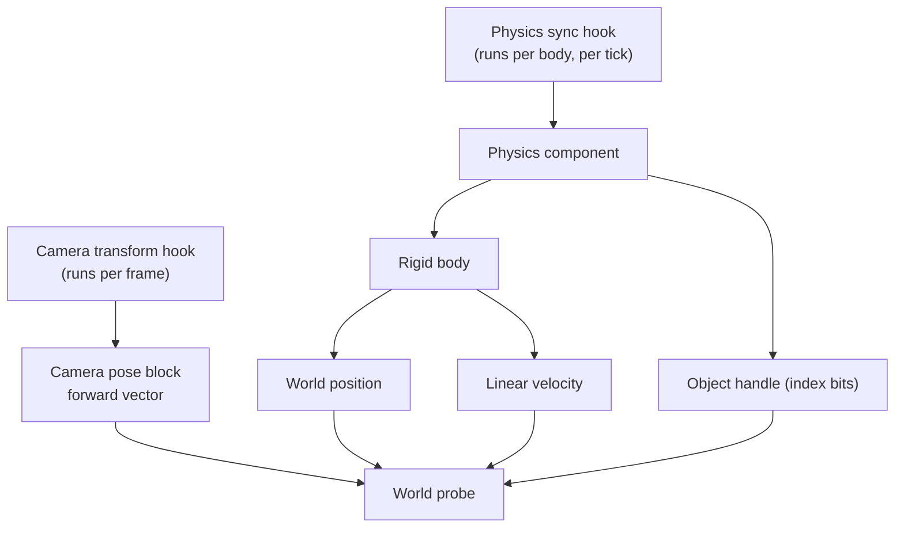

# Reverse engineering notes

This document records what is known about the Destiny 2 client memory layout, how that knowledge
was found, and which methods do not work. Read it before you start new research.

## 1. The executable is packed

`destiny2.exe` of the supported build is protected with VMProtect. The PE has these sections:

| Section          | Virtual address | Note              |
| ---------------- | --------------- | ----------------- |
| `.text`          | `0x140001000`   | Encrypted at rest |
| `.rdata`         | `0x141B91000`   | Partly encrypted  |
| `.vmp0`          | `0x14371E000`   | VMProtect data    |
| `.text` (second) | `0x143CC9000`   | Encrypted at rest |

Measured Shannon entropy of both code sections is about **8.0 bits per byte**, which is the value
of random data. Two results follow from this:

- **Byte-pattern search on the file does not work.** A very common prologue such as
  `40 53 48 83 EC` has zero matches in the file. Every signature in
  [`game_signatures.cpp`](../Sunrise/src/client/patterns/game_signatures.cpp) matches only the
  **running process**, after the protector has decrypted the code in memory.
- **String search on the file does not work.** The file holds no `raycast`, `health`, `entity` or
  similar strings, because the strings are also encrypted.

Do not spend time on static analysis of the shipped executable. New offsets have to be found in
the running process, for example with the log dump described below, or with a debugger.

## 2. What the client can read today

Both hooks are installed by
[`teleport_lifecycle.cpp`](../Sunrise/src/client/hooks/teleport/teleport_lifecycle.cpp). The
offsets are in [`internal.h`](../Sunrise/src/client/hooks/teleport/internal.h).

### Confirmed offsets

| Structure         | Offset | Field                                                                      |
| ----------------- | ------ | -------------------------------------------------------------------------- |
| Physics component | 44     | Object handle, `u16`. Its low 13 bits name one object.                     |
| Physics component | 400    | Rigid-body array                                                           |
| Physics component | 516    | Rigid-body index, signed                                                   |
| Rigid body        | 448    | World position, three floats (hypothesis, in use since the teleport works) |
| Rigid body        | 560    | Linear velocity, three floats                                              |
| Camera pose block | 1468   | Forward vector, three floats. Its default is `(1,0,0)`.                    |

The camera basis is **X forward, Z up**.

### Unconfirmed offsets

| Structure         | Offset | Field               | State                           |
| ----------------- | ------ | ------------------- | ------------------------------- |
| Camera pose block | 1480   | Second basis vector | Read, then validated at runtime |
| Camera pose block | 1492   | Third basis vector  | Read, then validated at runtime |
| Camera pose block | 1504   | Eye position        | Read, then validated at runtime |

The hypothesis is that the pose block holds a basis and then a translation, in that order, right
after the forward vector. The client never trusts it: `capture_forward` checks that the three
vectors are unit length and mutually perpendicular, and that the fourth vector is finite and
inside the world bound. `CameraPose` carries one flag per part, and the interface reports an
unproved part as unknown instead of showing it.

## 3. What is not reachable yet

| Wanted value                         | State         | Why                                                                                   |
| ------------------------------------ | ------------- | ------------------------------------------------------------------------------------- |
| Surface point at the crosshair       | Not reachable | The engine's own collision query has no signature yet, so no world trace can be made. |
| Object type or name at the crosshair | Not reachable | The object datum array that maps a handle to an object is not resolved.               |
| Health, shield, combatant state      | Not reachable | No field on the physics path is known to hold them.                                   |
| AI state                             | Not reachable | Same as health. It sits on the object, not on the physics component.                  |

The object handle **is** known for every tracked body. The missing step is the datum array that
turns that handle into an object pointer. Finding it in the running process is the next task for
this area, because every field above hangs off the object.

## 4. How to research new offsets in the running game

The Debug page of the Sunrise menu, described in
[`ui-and-diagnostics.md`](ui-and-diagnostics.md), holds two research tools:

1. **Memory view.** It shows the raw bytes of the player's physics component or of the picked
   target's component, at a chosen offset, as hexadecimal and as floats. Move in the game and
   watch which bytes change.
2. **Log dump.** The `Write a log dump` button writes these lines to the client log channel:
   - `part=local`: the player position, velocity, forward vector and the state of the pose flags.
   - `part=camera`: 32 floats of the camera pose block, starting four floats before the forward
     vector, with the offset of every line.
   - `part=body`: the nearest tracked bodies, with the object handle, the component address, the
     distance, the position and the velocity.

To confirm the eye-position offset, stand still and write a dump. In the `part=camera` lines,
find the float triple that is close to the player position from the `part=local` line, but about
one body height above it. That offset is the eye position. Record the result in this document.
