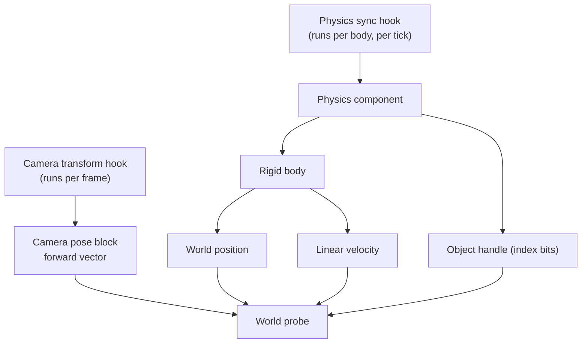

# Reverse engineering notes

This document records what is known about the Destiny 2 client memory layout, how that knowledge
was found, and which methods do not work. Read it before you start new research.

## 1. The executable is packed

`destiny2.exe` of the supported build is protected with VMProtect. The PE has these sections:

| Section          | Virtual address | Note              |
| ---------------- | --------------- | ----------------- |
| `.text`          | `0x140001000`   | Encrypted at rest |
| `.rdata`         | `0x141B91000`   | Partly encrypted  |
| `.vmp0`          | `0x14371E000`   | VMProtect data    |
| `.text` (second) | `0x143CC9000`   | Encrypted at rest |

Measured Shannon entropy of both code sections is about **8.0 bits per byte**, which is the value
of random data. Two results follow from this:

- **Byte-pattern search on the file does not work.** A very common prologue such as
  `40 53 48 83 EC` has zero matches in the file. Every signature in
  [`game_signatures.cpp`](../Sunrise/src/client/patterns/game_signatures.cpp) matches only the
  **running process**, after the protector has decrypted the code in memory.
- **String search on the file does not work.** The file holds no `raycast`, `health`, `entity` or
  similar strings, because the strings are also encrypted.

Do not spend time on static analysis of the shipped executable. New offsets have to be found in
the running process, for example with the log dump described below, or with a debugger.

## 2. What the client can read today

Both hooks are installed by
[`teleport_lifecycle.cpp`](../Sunrise/src/client/hooks/teleport/teleport_lifecycle.cpp). The
offsets are in [`internal.h`](../Sunrise/src/client/hooks/teleport/internal.h).

### Confirmed offsets

| Structure         | Offset | Field                                                                                    |
| ----------------- | ------ | ---------------------------------------------------------------------------------------- |
| Physics component | 44     | Object handle, `u16`. Its low 13 bits name one object.                                   |
| Physics component | 400    | Rigid-body array                                                                         |
| Physics component | 516    | Rigid-body index, signed                                                                 |
| Rigid body        | 448    | World position, three floats (hypothesis, in use since the teleport works)               |
| Rigid body        | 560    | Linear velocity, three floats                                                            |
| Camera pose block | 1428   | Eye position, three floats. Confirmed by the entity spawner of upstream pull request 46. |
| Camera pose block | 1468   | Forward vector, three floats. Its default is `(1,0,0)`.                                  |

The camera basis is **X forward, Z up**.

### Unconfirmed offsets

| Structure         | Offset | Field               | State                           |
| ----------------- | ------ | ------------------- | ------------------------------- |
| Camera pose block | 1480   | Second basis vector | Read, then validated at runtime |
| Camera pose block | 1492   | Third basis vector  | Read, then validated at runtime |

The first hypothesis was that the block holds a basis and then a translation, in that order, after
the forward vector. That was wrong: the eye position sits **before** the forward vector, at 1428.
The two basis vectors after the forward vector are still hypotheses. The client never trusts them:
`capture_forward` checks that the vectors are unit length and mutually perpendicular, and that the
position is finite and inside the world bound. `CameraPose` carries one flag per part, and the
interface reports an unproved part as unknown instead of showing it.

The camera pose block stride is `0xC50`.

### Game calls the client holds

These come from the entity spawner of upstream pull request 46 and the world population of pull
request 58. They are module-relative addresses, in
[`spawn_runtime.cpp`](../Sunrise/src/client/hooks/spawn/spawn_runtime.cpp).

| Name                    | RVA         | Use                                                    |
| ----------------------- | ----------- | ------------------------------------------------------ |
| World raycast           | `0x128E3D0` | Traces a segment against the world and reports the hit |
| Object factory          | `0x56D990`  | Creates one object from a placement                    |
| Object transform        | `0x559B10`  | Moves one object                                       |
| Tag resolver            | `0x1258970` | Turns an entity tag into its definition                |
| Placement initialize    | `0x4B2570`  | Fills one placement record                             |
| Player component update | `0xBB0DB0`  | Per-tick call the spawner runs its work on             |

The raycast signature is
`bool(const float* up, const float* up, const float* start, const float* end, int ignoreA,
int ignoreB, float radius, float* fraction, float* hitPoint, int* code)`. The meaning of `code` is
**not confirmed**. It is a material index or a hit datum handle. The Debug page shows it raw and
also tries to read it as an object handle, which is how the two can be told apart.

### The object datum array

| Name                | Value       | Note                                            |
| ------------------- | ----------- | ----------------------------------------------- |
| Descriptor          | `0x1F93420` | Module-relative                                 |
| Base pointer offset | `0x08`      | Inside the descriptor                           |
| Stride offset       | `0x10`      | Inside the descriptor. Its value must be `0xE0` |
| Record size         | `0xE0`      | One object record                               |
| Handle offset       | `0x0C`      | Inside the record. Holds the full handle        |

A handle names a record at `base + (handle & 0x1FFF) * stride`. The record holds the **full**
handle at `0x0C`, which is the index bits plus a generation counter. The physics component reports
only the 13 index bits, so `object_record_by_index` reads the record first and takes the full
handle from it.

## 3. What is not reachable yet

| Wanted value                         | State     | Why                                                                        |
| ------------------------------------ | --------- | -------------------------------------------------------------------------- |
| Wanted value                         | State     | Note                                                                       |
| ------------------------------------ | --------- | -------------------------------------------------------------------------- |
| Surface point at the crosshair       | Reachable | The world raycast reports it. The Debug page shows it.                     |
| Object record at the crosshair       | Reachable | The datum array resolves the handle. The Debug page shows the raw record.  |
| Object type or name at the crosshair | Partly    | The type sits at `0x96` of the **definition**, not of the record.          |
| Health, shield, combatant state      | Unknown   | No offset inside the object record is confirmed to hold them.              |
| AI state                             | Unknown   | Same as health.                                                            |

The object record is now readable, so health and AI state are a search inside 224 known bytes
instead of an unbounded one. Use the `Unit state` section of the Debug page: pick a unit, read the
record as floats, then hurt the unit and watch which lane falls.

## 4. How to research new offsets in the running game

The Debug page of the Sunrise menu, described in
[`ui-and-diagnostics.md`](ui-and-diagnostics.md), holds two research tools:

1. **Memory view.** It shows the raw bytes of the player's physics component or of the picked
   target's component, at a chosen offset, as hexadecimal and as floats. Move in the game and
   watch which bytes change.
2. **Log dump.** The `Write a log dump` button asks for one dump. The dump runs on the next game
   tick, because the body table belongs to the game thread. The result is shown in the page and
   can be copied with `Copy the dump`.

   The same lines also go to the client log channel at `info`. The shipped level for that channel
   is `warn` (see `Sunrise/resources/default_settings.json`), so a normal run drops the log copy.
   Raise `core.logging.levels.client` to `info` if you want the lines in the log file as well, and
   set `file_sink` to `true` to keep them.

   The dump holds these lines:
   - `part=local`: the player position, velocity, forward vector and the state of the pose flags.
   - `part=camera`: 32 floats of the camera pose block, starting four floats before the forward
     vector, with the offset of every line.
   - `part=target`: the picked body, with its index bits, its full handle, its object record
     address, its distance and its position.
   - `part=surface`: the world-trace result, with the trace code, whether that code resolved as an
     object handle, the covered part of the segment, the distance and the hit position.
   - `part=body`: the nearest tracked bodies, with the object handle, the component address, the
     distance, the position and the velocity.

### Open questions to answer with the dump

1. **What does the trace code mean?** Aim at a wall and at a unit, then write a dump both times.
   If `resolved=1` only when a unit is aimed at, the code is a hit object handle.
2. **Where is health?** Spawn a combatant with the entity spawner, aim at it, open `Unit state`,
   and note the record offset of a float that falls when the unit is hurt.
3. **Are the two vectors after the forward vector really a basis?** The `part=camera` lines hold
   32 floats around the forward vector. Turn on the spot and watch which triples turn with you.
