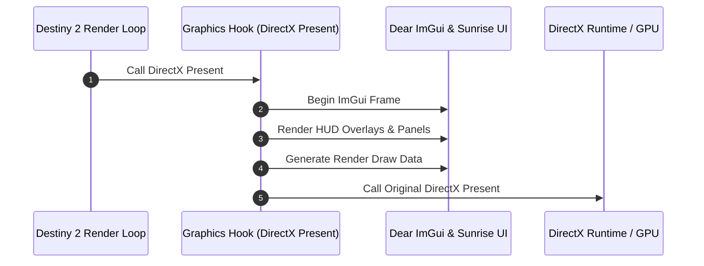

# User interface and diagnostics

This document describes the in-game Dear ImGui interface, HUD overlays, diagnostic logging tools, and input integration in Sunrise.

## UI architecture overview

Sunrise embeds a customized Dear ImGui runtime directly inside the Destiny 2 process. The overlay renders on top of the game screen without external window managers.

---

## 1. Dear ImGui theme and presentation

Sunrise uses an in-house theme and styling system:

- **Theme engine**: Dark palette with gold and blue accents, customized padding, and rounded borders.
- **DPI scaling**: Scales font sizes and UI geometry according to display DPI.
- **Font management**: Loads bundled TrueType fonts and system fonts at runtime.
- **Animation system**: Provides smooth easing transitions for opening menus, fading notices, and tab switching.

---

## 2. HUD overlays

Sunrise displays in-game HUD widgets:

- **Session overlay**: Displays active destination name, bubble hash, connection state, and server tick rate.
- **Status overlay**: Displays player 3D coordinates (X, Y, Z), camera angles (yaw, pitch, roll), and current movement velocity.
- **Logo overlay**: Displays Sunrise version and branding badge.

---

## 3. Interactive UI modules

Sunrise organizes UI panels using a modular registry (`ui_module_registry.h`):

### Core modules

- **Logs viewer (`ui/modules/logs/`)**:
  - Displays real-time log messages from the Core ring buffer.
  - Filters messages by channel (`core`, `client`, `server`, `bap`, `gameplay`, `state`, `steam`).
  - Filters messages by log level (`debug`, `info`, `warn`, `error`).
  - Supports live string search and pause/resume toggles.

### Client modules

- **Movement panel (`client/ui/movement/`)**:
  - Toggles fly mode, noclip, and sword skating enhancements.
  - Configures movement speed multipliers.
  - Saves and loads 3D teleport bookmarks.
- **Player panel (`client/ui/player/`)**:
  - Toggles infinite ammo and removes reload delays.
  - Disables inactivity AFK kick timers.
- **Debug panel (`client/ui/debug/`)**: see section 3.1.

### 3.1 Debug panel

The Debug panel reports what the client can prove about the local player and about what the
camera points at. It reads from the world probe (`client/world/world_probe.cpp`).

**Data source.** The physics sync hook reports every physics component it runs for. The probe
keeps the last position, velocity and object handle of each one in a fixed table of 512 slots. An
entry that no tick reports for 500 ms is dropped. The probe reads only while the Debug page is
open: the page renews a scan request every frame, and without that request the physics tick costs
one atomic read per component.

**Sections.**

| Section             | Content                                                                                                                         |
| ------------------- | ------------------------------------------------------------------------------------------------------------------------------- |
| Player position     | World position, velocity, speed, camera forward vector, yaw and pitch, and the eye position when the pose read is proved.       |
| Player state        | In-world flag, controlled object handle, physics component address, activity name, session, region, bubble and slice-set state. |
| Crosshair ray       | Ray origin, and the point the ray reaches at a chosen probe distance.                                                           |
| Target at crosshair | The picked body: object handle, world position, distance, distance off the ray, angle, velocity, speed and component address.   |
| Unit state          | States that health, combatant state and AI state are not reported yet, and why.                                                 |
| Memory view         | Raw bytes of the player's or the target's physics component, as hexadecimal and as floats.                                      |
| Probe               | Tracked and considered body counts, pick radius, pick range, and the log dump button.                                           |

**Limits you must keep in mind.**

- The pick is **not** a collision query. It selects the body nearest the camera ray inside the
  pick radius. The engine's own world trace has no signature yet, so the reported ray point is the
  ray at a set distance and not a surface hit.
- Only bodies that the physics tick reports can be picked. Map geometry has no such body and never
  appears.
- The ray starts at the camera eye only when the eye-position read passes its checks. Otherwise it
  starts at the player body, and the page says which origin was used.
- Health, combatant state and AI state need the object datum array, which is not resolved yet. See
  [`reverse-engineering-notes.md`](reverse-engineering-notes.md).
- The dump runs on the next game tick, not on the click, because the body table belongs to the
  game thread. It is shown in the page itself: the shipped client log level is `warn`, so the log
  copy of the dump is dropped on a normal run.

### Server modules

- **Activity override panel (`server/ui/activity_override/`)**:
  - Forces destination hashes and spawn set overrides when launching destinations from the director.

---

## 4. Input handling and cursor management

When the user opens the Sunrise menu (default key: `F2` or `Insert`):

- **Window message hook**: Intercepts `WM_KEYDOWN`, `WM_KEYUP`, `WM_MOUSEMOVE`, and mouse clicks to feed Dear ImGui.
- **Input routing**: Suppresses game keyboard and mouse inputs so the game does not react while interacting with UI menus.
- **Cursor guard**: Releases Windows mouse clipping and restores cursor visibility while the menu is active.

---

## 5. Wine and Proton compatibility

Sunrise supports running on Linux via Wine and Valve's Proton:

- **`wine_compat.h`**: Detects Wine runtime environments.
- **DirectX translation**: Adjusts swap chain presentation and viewport synchronization when DXVK or VKD3D-Proton is active.
